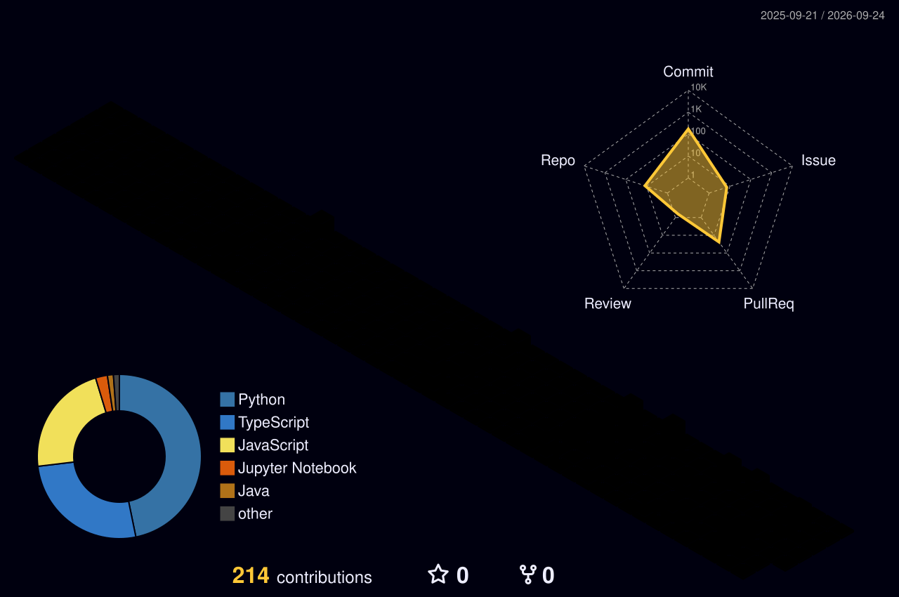

<div align="center">

# Mohammad Raees

### Crafting the Future, One Commit at a Time

🌍 **Building AI systems, full-stack products & open-source infrastructure**

<br/>

[](https://www.linkedin.com/in/mohd-raees/)
[](https://github.com/Mohammad-Raees)
[](mailto:mohammadraees3rd@gmail.com)
[](https://leetcode.com/u/Mohammad-Raees/)
[](https://codeforces.com/profile/Mohd_Raees)
[](https://www.codechef.com/users/mohd_raees)


</div>

<br/>

---

##  Who Am I

<table>
<tr>
<td width="58%" valign="top">

```js
const mohammadRaees = {
  name: "Mohammad Raees",
  role: "Full Stack Developer & AI/ML Enthusiast",
  study: "B.Tech CSE (AI/ML) @ AKGEC, India",
  location: "India 🇮🇳",
  focus: [
    "Open Source (Apicurio Registry)",
    "A2A / MCP Protocol Tooling",
    "Full-Stack & AI Products"
  ],
  mantra: "Ship fast. Learn faster. Build things that matter.",
  openTo: ["Internships", "Collaborations", "OSS", "Mentorship"]
};
```

</td>
<td width="42%" valign="top">


</td>
</tr>
</table>

- 🔭 Contributing to **[Apicurio Registry](https://github.com/Apicurio/apicurio-registry)** — Agent Cards, Prompt Templates & UI
- 🛠️ Built **[protocol-validator](https://github.com/Mohammad-Raees/protocol-validator)** — A2A + MCP validation CLI on [npm](https://www.npmjs.com/package/protocol-validator)
- 💰 Built **[Spendly](https://github.com/Mohammad-Raees/Spendly)** — personal expense tracker (Flask + SQLite)
- 🏡 Building **[DreamStays](https://github.com/Mohammad-Raees/DreamStays)** — full-stack stays platform
- 🎓 Deepening **Distributed Systems, LLMs, System Design & DSA**
- 👾 Open source contributor — I believe in building in public
- 💬 Ask me about **React, TypeScript, Java, Node.js, Python, or AI/ML**
- ⚡ Fun fact: I debug faster with coffee and a good stack trace

---

##  Tech Arsenal

### Languages


### Frontend


### Backend & Databases


### Cloud, DevOps & Tools


### AI / ML & Protocols


---

##  GitHub Intelligence

<div align="center">

<a href="https://github.com/Mohammad-Raees">
  
</a>
&nbsp;&nbsp;
<a href="https://github.com/Mohammad-Raees">
  
</a>

<br/><br/>


<br/><br/>


</div>

---

## 🌐 3D Contribution Graph

<div align="center">

<!-- Generated daily by .github/workflows/profile-3d.yml -->


<br/>


</div>

---

## 🚀 Featured Projects

<table>
  <tr>
    <td width="50%" valign="top">
      <h3>🛠️ protocol-validator</h3>
      <p>CLI + library to validate <b>A2A Agent Cards</b> and <b>MCP Tools</b> with <code>none</code> / <code>syntax</code> / <code>full</code> levels — inspired by Apicurio Registry validators.</p>
      <p>
        
        
        
        
      </p>
      <a href="https://github.com/Mohammad-Raees/protocol-validator"></a>
      <a href="https://www.npmjs.com/package/protocol-validator"></a>
    </td>
    <td width="50%" valign="top">
      <h3>💰 Spendly</h3>
      <p>Personal expense tracker with budgets, categories, dashboards, date filters, and analytics — built with Flask & SQLite.</p>
      <p>
        
        
        
      </p>
      <a href="https://github.com/Mohammad-Raees/Spendly"></a>
    </td>
  </tr>
  <tr>
    <td width="50%" valign="top">
      <h3>🏡 DreamStays</h3>
      <p>Full-stack stays / booking-style platform exploring modern JavaScript product flows and UI craft.</p>
      <p>
        
        
      </p>
      <a href="https://github.com/Mohammad-Raees/DreamStays"></a>
    </td>
    <td width="50%" valign="top">
      <h3>🔥 Algerian Forest Fire Prediction</h3>
      <p>Machine learning notebook project for forest-fire risk prediction — applied AI/ML coursework turned into a public portfolio piece.</p>
      <p>
        
        
        
      </p>
      <a href="https://github.com/Mohammad-Raees/Algerian-Forest-Fire-Prediction"></a>
    </td>
  </tr>
</table>

---

## 🌐 Open Source Contributions

<div align="center">

*The best code is code the world can see, improve, and build upon.*

</div>

| Activity | Details |
|---|---|
| 🔨 **Bug Fixes** | UI & schema validation fixes in Apicurio Registry (Agent Cards, Prompt Templates) |
| 📄 **Documentation** | Clarified contribution / storage-variant docs and polished READMEs |
| 🔍 **Protocol Alignment** | Cross-referenced A2A v1.0 backend validators with TypeScript UI models |
| 🌱 **Apicurio Registry** | Active contributor — [PR #9141](https://github.com/Apicurio/apicurio-registry/pull/9141) |
| 💡 **Issue Analysis** | Filed / investigated genuine UI & validation bugs with root-cause writeups |

<p align="center">
  
  
  
  
</p>

---

## 🧩 Competitive Programming Tracker

<div align="center">

| Platform | Profile | Notes |
|---|---|---|
| **LeetCode** | [@Mohammad-Raees](https://leetcode.com/u/Mohammad-Raees/) | DSA practice & problem solving |
| **Codeforces** | [@Mohd_Raees](https://codeforces.com/profile/Mohd_Raees) | Contests & rating growth |
| **CodeChef** | [@mohd_raees](https://www.codechef.com/users/mohd_raees) | ⭐ 1★ · Rating **1341** · 55+ problems · 8 contests |

<br/>

<a href="https://leetcode.com/u/Mohammad-Raees/">
  
</a>

</div>

---

## 🧠 Currently Learning & Building

```text
📚 Learning     -> System Design & Distributed Systems
👾 Exploring    -> LLMs, A2A Protocol, MCP Tooling
⚙️ Building     -> protocol-validator upgrades + DreamStays
🌐 Contributing -> Apicurio Registry (UI + schema validation)
📖 Reading      -> DDIA + Designing Machine Learning Systems
🎯 Applying     -> LFX Mentorship (Apicurio AI artifact tooling)
```

<p align="center">
  
  
  
  
</p>

---

## 🤝 Let's Connect

<p align="center">
  <a href="https://www.linkedin.com/in/mohd-raees/"></a>
  <a href="mailto:mohammadraees3rd@gmail.com"></a>
  <a href="https://github.com/Mohammad-Raees"></a>
  <a href="https://leetcode.com/u/Mohammad-Raees/"></a>
</p>

<div align="center">

**Open to:** Internships · Collaborations · Open Source · Mentorship

<br/>


<br/>

⭐️ From [`Mohammad-Raees`](https://github.com/Mohammad-Raees)

</div>
